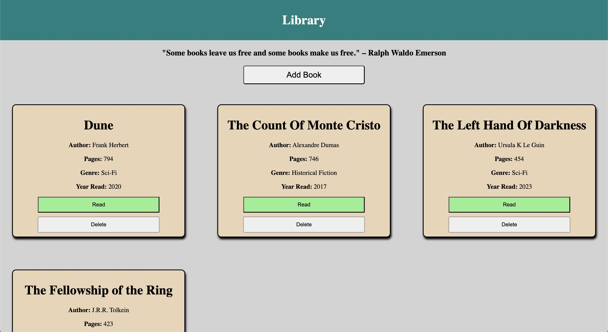

# Library
A library application written to store books that you've read

## Some topics I learned
<li>JavaScript Classes</li>
<li>Branching to refactor code</li>
<li>Utilizing the localstorage object</li>
<li>Class constructors</li>

  
I had a fun time creating this project, mostly because I love reading and this gave me a fun way to store the books I've read and which year I'd read them. 

I wanted to go a little bit more wild with it and track stats such as "Longest book read", "Most read genre", and "Favorite Author". I think what I've started to realize it that it's fun to come back to projects and re-work them with new ideas you gain along the way. Working too hard on one project may in fact drive me crazy as I learn more about web development and programming as a whole.

